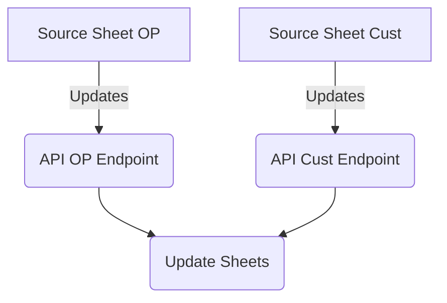

# Pick list updater
## Summary
Updates pick lists for everyone's sheets with info from source sheets. Each source sheet has a webhook that triggers when the sheet is updated that send the sheet ID to it's respective endpoint. Each endpoint then gets the column it needs and adds that column to every sheet's picklist options for that column.

## Platforms
* Kubernetes: Hosts the api
* Smartsheets: Event based webhooks trigger updates
* Concourse/Argo: CI/CD

## Code Flow

## Code Requirements
* uvicorn: Serve Fast API
* fastapi: API Framework
* smartsheet-python-sdk: Smartsheet SDK
* python-dotenv: read .env
* loguru: logging